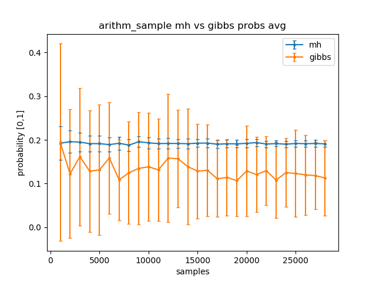
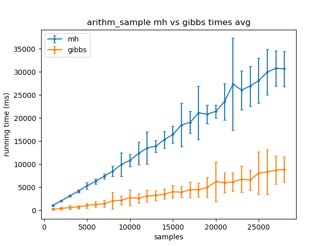
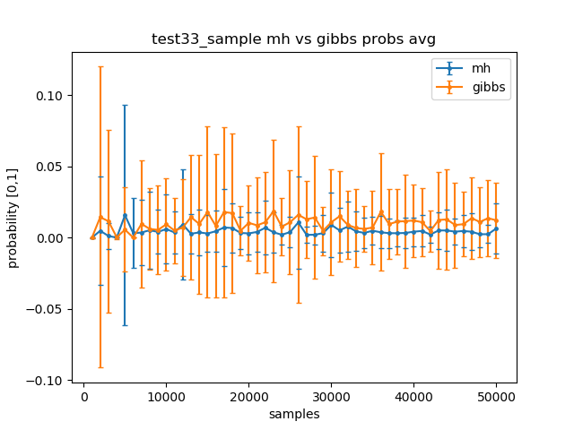
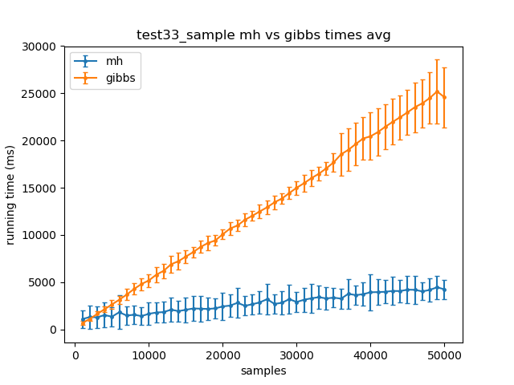
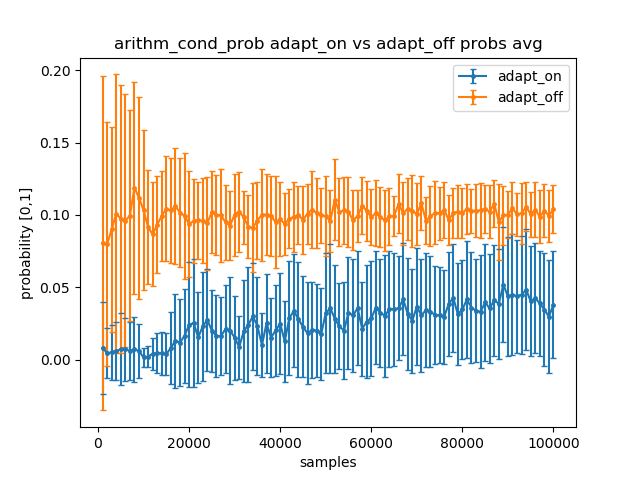
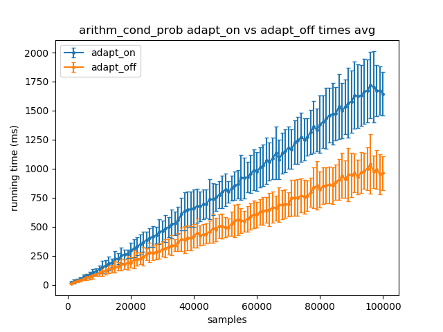
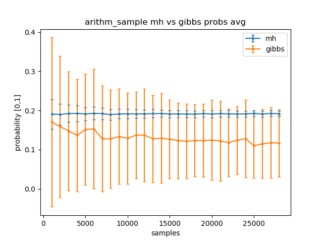
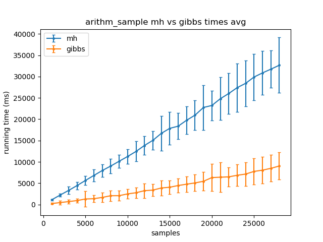
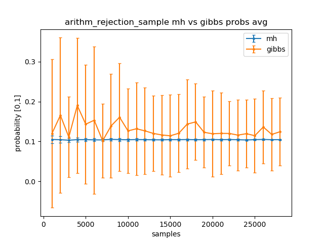
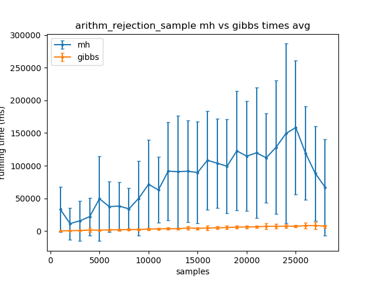

# Experimental results of AMCMC and MCINTYRE comparisons

## Table of contents

- [Experimental results of AMCMC and MCINTYRE comparisons](#experimental-results-of-amcmc-and-mcintyre-comparisons)
  - [Table of contents](#table-of-contents)
  - [Abstract](#abstract)
  - [Introduction](#introduction)
  - [Materials and methods](#materials-and-methods)
    - [Hardware](#hardware)
    - [Software](#software)
  - [Key](#key)
    - [The *Summary* tables](#the-summary-tables)
    - [The *Software versions* tables](#the-software-versions-tables)
  - [Experiments](#experiments)
    - [Experiment 0](#experiment-0)
      - [Summary](#summary)
      - [Software versions](#software-versions)
      - [Plots](#plots)
    - [Experiment 1](#experiment-1)
      - [Summary](#summary-1)
      - [Software Versions](#software-versions-1)
      - [Plots](#plots-1)
    - [Experiment 2](#experiment-2)
      - [Summary](#summary-2)
      - [Software Versions](#software-versions-2)
      - [Plots](#plots-2)
    - [Experiment 3](#experiment-3)
      - [Summary](#summary-3)
      - [Software Versions](#software-versions-3)
      - [Plots](#plots-3)
    - [Experiment 4](#experiment-4)
      - [Summary](#summary-4)
      - [Software Versions](#software-versions-4)
      - [Plots](#plots-4)

## Abstract

TODO

## Introduction

TODO

## Materials and methods

The independent variable is the number of *samples*, i.e. the number of steps 
to approximate the distribution. What we want to measure the dependent 
variable, time.

Every experiment is repeated on a different processor thread. The results of 
these experiments are grouped by sample size so it is possible to compute the 
average running times and standard deviations.

Once the data is saved on a CSV file and after some statistical 
computations, plotting is carried out.

### Hardware

| Computer id | Processor cores | Threads per core | Memory (GB) | Swap (GB) | Virtual machine | OS | comment |
|-------------|-----------------|------------------|-------------|-----------|-----------------|----|---------|
| 0 | 4 | 1 | 14 | 1 | yes | Parabola GNU/Linux-libre x86-64 | |
| 1 | ? | ? | ? | ? | ? | ? | COKA UNIFE |

### Software

Two prolog systems have been used:
- *SWI Prolog*
- *XSB Prolog*

See https://github.com/frnmst/mcmc-comparisons#dependencies

To measure the running times, the two prolog systems have been instructed to 
repeat a specific experiment, with fixed parameters, several number of times. 
This aspect is very important also because of the stochastic nature of these 
experiments. 

Plotting is handled by Matplotlib while some statitical computations are done 
by NumPy, both of which are Python libraries.

For each plot the standard deviation is represented by error bars.

## Key

An explanation of the structure of the tables.

### The *Summary* tables

|  -   | Name | Computer id | Command | Data |
|------|------|-------------|---------|------|
| Comment | the experiment name as used in the command | the computer that executed the experiment | the CLI command or file | a link to the raw CSV file containing the results |
| Type | str | int | str:verbatim | str:link |

### The *Software versions* tables

A *Software version* table contains references to the commit hash (the 
short version of the SHA-1 git commit hash) or the software version used 
for that particular experiment.

Software which has not been used for an experiment is marked with a dash 
character: `-`

## Experiments

### Experiment 0

#### Summary

| Name | Computer id | Command | Data |
|------|-------------|---------|------|
| arithm_sample | 0 | `./run.sh --repetitions=16 -p -t arithm_sample -g -M 28000` | [data/experiment-0/arithm_sample.csv](data/experiment-0/arithm_sample.csv) |

#### Software versions

| cplint | mcmc-comparision | Adapative-MCMC | SWI Prolog | XSB Prolog |
|--------|------------------|----------------|------------|------------|
| [077a951](https://github.com/friguzzi/cplint/tree/077a951b866a7433236cfa0ef622a3b936fd57a6) | [aa6106b](https://github.com/frnmst/mcmc-comparisons/tree/aa6106bfefab31aced4e7962c2d4863ea3d0e19f) | - | `7.7.19` | - |

#### Plots

### Experiment 1

#### Summary

| Name | Computer id | Command | Data |
|------|-------------|---------|------|
| test33_sample | 0 | `./run.sh --repetitions=16 -p -t test33_sample -g -M 50000` | [data/experiment-1/test33_sample.csv](data/experiment-1/test33_sample.csv) |

#### Software Versions

| cplint | mcmc-comparision | Adapative-MCMC | SWI Prolog | XSB Prolog |
|--------|------------------|----------------|------------|------------|
| [077a951](https://github.com/friguzzi/cplint/tree/077a951b866a7433236cfa0ef622a3b936fd57a6) | [aa6106b](https://github.com/frnmst/mcmc-comparisons/tree/aa6106bfefab31aced4e7962c2d4863ea3d0e19f) | - | `7.7.19` | - |

#### Plots

### Experiment 2

#### Summary

| Name | Computer id | Command | Data |
|------|-------------|---------|------|
| arithm_cond_prob | 0 | `./run.sh -p -t arithm_cond_prob --repetitions=16 -y xsb -g -M 100000` | [data/experiment-2/arithm_cond_prob.csv](data/experiment-2/arithm_cond_prob.csv) |

#### Software Versions

| cplint | mcmc-comparision | Adapative-MCMC | SWI Prolog | XSB Prolog |
|--------|------------------|----------------|------------|------------|
| - | [4fa657c](https://github.com/frnmst/mcmc-comparisons/tree/4fa657c3317e09524c6f081d7fe9b26bac7f877f) | [db4e371](https://github.com/frnmst/Adaptive-MCMC/tree/db4e37120d60680cb0302b05c18aee815fe54c72) | - | `3.8.0` |

#### Plots

### Experiment 3

#### Summary

| Name | Computer id | Command | Data |
|------|-------------|---------|------|
| arithm_sample | 0 | `./run.sh --repetitions=64 -p -t arithm_sample -g -M 28000` | [data/experiment-3/arithm_sample.csv](data/experiment-3/arithm_sample.csv) |

#### Software Versions

| cplint | mcmc-comparision | Adapative-MCMC | SWI Prolog | XSB Prolog |
|--------|------------------|----------------|------------|------------|
| [077a951](https://github.com/friguzzi/cplint/tree/077a951b866a7433236cfa0ef622a3b936fd57a6) | [4fa657c](https://github.com/frnmst/mcmc-comparisons/tree/4fa657c3317e09524c6f081d7fe9b26bac7f877f) | - | `7.7.19` | - |

#### Plots

### Experiment 4

#### Summary

| Name | Computer id | Command | Data |
|------|-------------|---------|------|
| arithm_rejection_sample | 0 | `./run.sh --repetitions=16 -p -t arithm_rejection_sample -g -M 28000` | [data/experiment-4/arithm_rejection_sample.csv](data/experiment-4/arithm_sample.csv) |

#### Software Versions

| cplint | mcmc-comparision | Adapative-MCMC | SWI Prolog | XSB Prolog |
|--------|------------------|----------------|------------|------------|
| [077a951](https://github.com/friguzzi/cplint/tree/077a951b866a7433236cfa0ef622a3b936fd57a6) | [f0e6b2d](f0e6b2de5800f9f74f8b73e2178e22fc64e76b08) | - | `8.0.1` | - |

#### Plots

