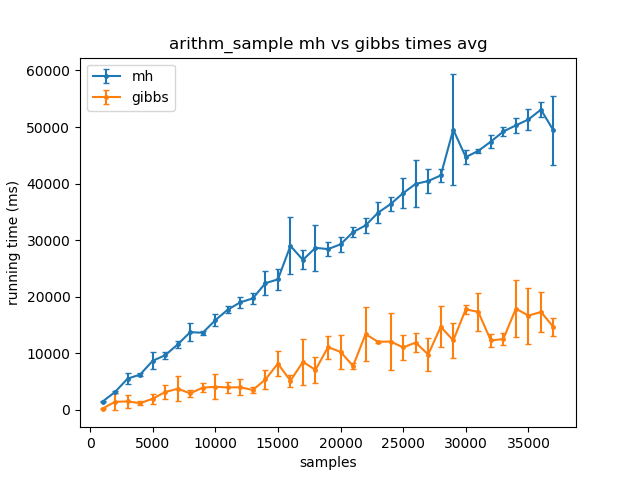
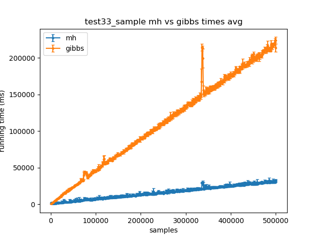
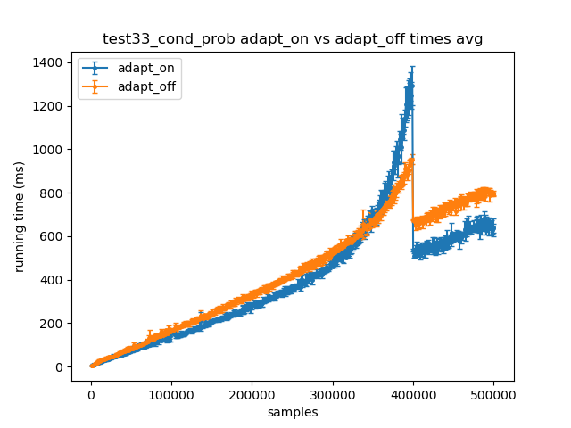

# A Comparison between AMCMC and MCINTYRE

## Table of contents

- [A Comparison between AMCMC and MCINTYRE](#a-comparison-between-amcmc-and-mcintyre)
    - [Table of contents](#table-of-contents)
    - [Abstract](#abstract)
    - [Introduction](#introduction)
    - [Materials and methods](#materials-and-methods)
        - [Hardware](#hardware)
        - [Software](#software)
    - [Results](#results)
        - [arithm_sample](#arithm_sample)
        - [test33_sample](#test33_sample)
        - [test33_adapt_on_vs_adapt_off](#test33_adapt_on_vs_adapt_off)
        - [test33 four way comparison](#test33-four-way-comparison)
        - [TODO: add test33 --multi-switch](#todo-add-test33---multi-switch)

## Abstract

TODO

## Introduction

TODO

## Materials and methods

The independent variable is the number of *samples*, i.e. the number of steps 
to approximate the distribution. What we want to measure the dependent 
variable, time.

Every experiment is repeated on a different processor thread. The results of 
these experiments are grouped by sample size so it is possible to compute the 
average running times and standard deviations.

Once the data is saved on a CSV file and after some statistical 
computations, plotting is carried out.

### Hardware

Most of the experiments have been run in a virtual machine with 4 cores 
assigned and a total memory of 7 Gigabytes, 1 of which as swap. For one 
particular experiment a physical computer with 12 Gigabytes of memory was used 
due to the memory *restraints* of the virtual machine.

| Processor cores | Threads per core | Memory (GB) | Swap (GB) | Virtual machine |
|-----------------|------------------|-------------|-----------|-----------------|
| 4               | 1                | 6           | 1         | x               |
| 2               | 2                | 12          | 0 (FIXE:check this) | |

### Software

Two prolog systems have been used:
- *SWI Prolog*
- and *XSB Prolog*

To measure the running times, the two prolog systems have been instructed to 
repeat a specific experiment, with fixed parameters, several number of times. 
This aspect is very important also because of the stochastic nature of these 
experiments. 

Plotting is handled by Matplotlib while some statitical computations are done 
by NumPy, both of which are Python libraries.

## Results

For each plot the standard deviation is represented by error bars.

### arithm_sample

This experiments uses a lot of memory.

### test33_sample

### test33_adapt_on_vs_adapt_off single switch

TODO: RE-RUN THIS

### test33 four way comparison

As you can see from this plot the AMCMC implementation, even without 
adaptation, is much faster than the one XSB Prolog for ?several orders? of 
magnitude.

### test33_adapt_on_vs_adapt_off multi switch

TODO

## Conclusions

TODO
